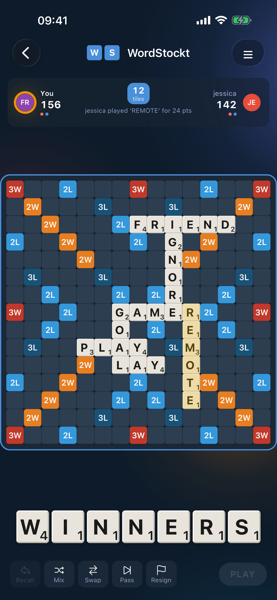
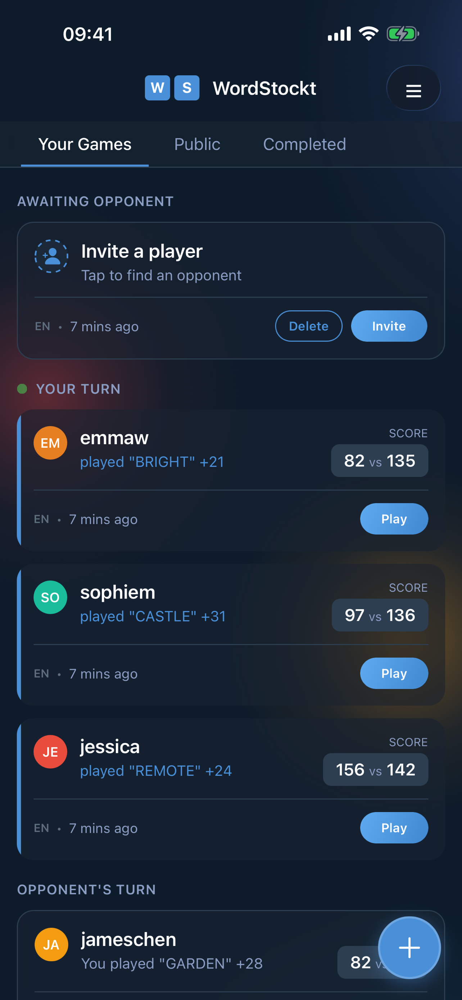
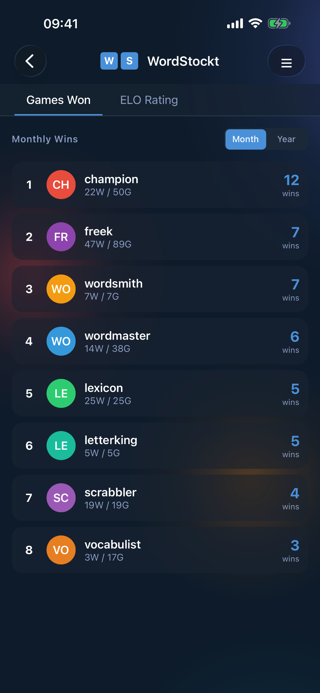
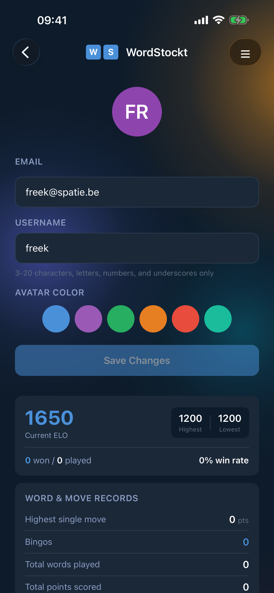

# WordStockt

A multiplayer word game. This repository contains the React Native mobile app that connects to the [backend](https://github.com/spatie/wordstockt.com).

**Download:** [iOS App Store](https://apps.apple.com/app/wordstockt/id6757525145) · [Google Play Store](https://play.google.com/store/apps/details?id=com.wordstockt.app)

## About

WordStockt lets you challenge friends to word battles on a 15x15 board. Form words, score points, and prove your vocabulary prowess.

Read about [how this was built in ~10 days](https://freek.dev/2983-i-built-a-native-mobile-word-game-in-two-weeks) as an experiment in AI-assisted development.

## Features

- Asynchronous multiplayer matches with friends
- Player statistics and leaderboards
- Push notifications for turn alerts
- Free with no advertisements
- Available on iOS and Android

## Screenshots

<p align="center">
  
  
  
  
</p>

## Tech Stack

- React Native 0.81 with Expo
- TypeScript (strict mode)
- React Native Paper (Material Design 3)
- TanStack Query for data fetching
- Zustand for state management
- Zod for runtime validation
- Expo Router for navigation

## Requirements

- Node.js 18+
- iOS Simulator or Android Emulator (or physical device)
- EAS CLI (`npm install -g eas-cli`)

## Installation

```bash
git clone git@github.com:spatie/wordstockt-app.git
cd wordstockt-app
npm install
```

## Commands

### Development

```bash
npm run dev              # Start Expo dev server
npm run dev:prod-api     # Start with production API
npm run ios              # Run on iOS simulator
npm run android          # Run on Android emulator
npm run web              # Run in browser
```

### Building

```bash
npm run build            # Build development iOS app (internal distribution)
npm run build:prod       # Build production iOS app (App Store)
npm run build:all        # Build development app for iOS + Android
```

### OTA Updates

Push JavaScript changes instantly without rebuilding:

```bash
npm run update           # Push update to development builds
npm run update:prod      # Push update to production builds
```

Updates are delivered via EAS Update. Devices receive updates on app launch.

### Testing

```bash
npm test                 # Run tests
npm run test:watch       # Run tests in watch mode
npm run test:coverage    # Run tests with coverage
```

### Code Quality

```bash
npm run format           # Format code with Prettier
npm run format:check     # Check formatting
```

## Release workflow

1. Merge and verify the matching `wordstockt.com` API changes before releasing an app that uses new response fields.
2. Keep `google-services.json` and `google-service-account.json` outside Git. The production and development EAS environments provide `GOOGLE_SERVICES_JSON` as a file variable for cloud builds. A local Android build uses `google-services.json` in the project root.
3. Increment `version`, `ios.buildNumber`, and `android.versionCode` in `app.json`. Run `npx expo-doctor`, `npm test -- --runInBand`, `npx tsc --noEmit`, and `npm run lint`.
4. Build both stores with `eas build --profile production --platform all`. Check the resulting build numbers and install the builds on test devices.
5. Submit iOS with `eas submit --profile production --platform ios --latest`. Submit Android with `eas submit --profile production --platform android --latest`; the configured Android track is `internal` for testing before a public rollout.

For JavaScript-only fixes to an existing runtime version, use `npm run update:prod -- --message "Describe the fix"` after testing the same update on a development build.

## Contributing

Contributions are welcome! Please feel free to submit a Pull Request.

## License

The MIT License (MIT). Please see [License File](LICENSE.md) for more information.
